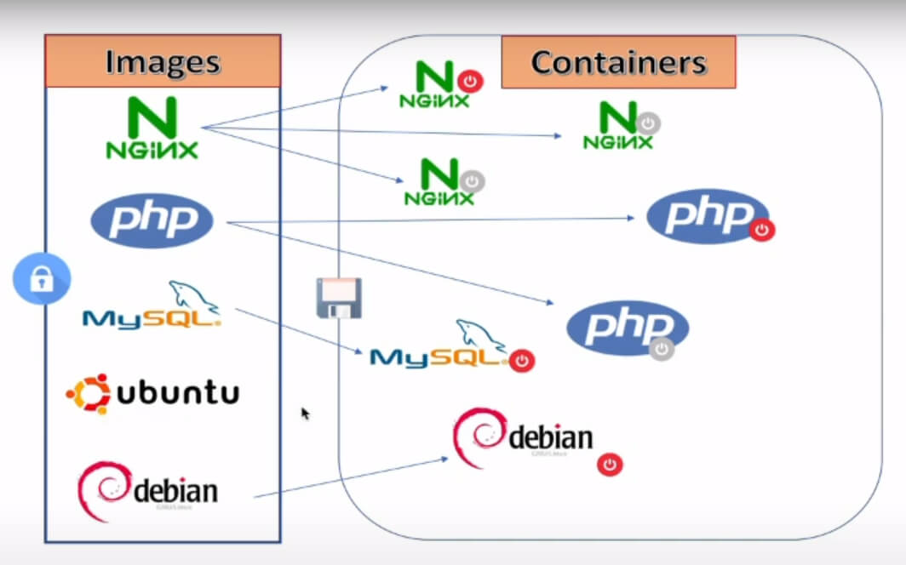

# Docker là gì ?

> **Docker** là nền tảng phần mềm cho phép bạn dựng, kiểm thử và triển khai ứng dụng một cách nhanh chóng.

> **Docker** đóng gói phần mềm vào các **Container** có mọi thứ mà phần mềm cần để chạy, trong đó có thư viện, công cụ hệ thống, code và thời gian chạy.

> [Docker's Home Page](https://www.docker.com/), [Docker hub](https://hub.docker.com/)

# Docker vs Virtual Machine

> **Virtual Machine** chia tài nguyên máy ảo thành nhiều phần riêng biệt để cài một hệ điều hành lên đó (chạy như một máy thật). Điều đó làm lãng phí rất nhiều tài nguyên.

> **Docker** chia sẻ tài nguyên và chạy trên chính hệ điều hành của máy chủ. Tiết kiệm và chạy nhanh hơn rất nhiều.

> **VM** ảo hóa (virtualization) ở phần cứng (hardware level), còn **Docker** ảo hóa (containerization) ở tầng ứng dụng (app level).


# Cài đặt Docker trên Arch Linux

```sh
  sudo pacman -S docker
  sudo systemctl start docker.service
  # Thêm người dùng hiện tại vào group docker
  usermod -aG docker $USER
```

> Chuyển nơi lưu trữ Image

```sh
  cp -r <old_dir> <new_dir>
  # Ex
  cp -r /var/lib/docker /mnt/docker

  # Configure data-root in /etc/docker/daemon.json
  {
    "data-root": "/mnt/docker"
  }

```

# Images, Containers là gì ?

> **Image** là những phần mềm được đóng gói trong Docker, chỉ đọc, chứa các source code, libraries, dependencies, tools và các files khác cần thiết cho một ứng dụng để chạy.

> **Image** đôi khi còn gọi là **Snapshot**. Chúng đại diện cho một application và virtual environment của nó tại một thời điểm cụ thể. Nó cho phép các developers test và thử nghiệm phần mềm trong điều kiện ổn định, thống nhất. **Image** là cơ sở để tạo dựng nên các **Container**.

> **Container** là một **Run-time environment** được tạo từ các Image mà ở đó người dùng có thể chạy một ứng dụng độc lập.


