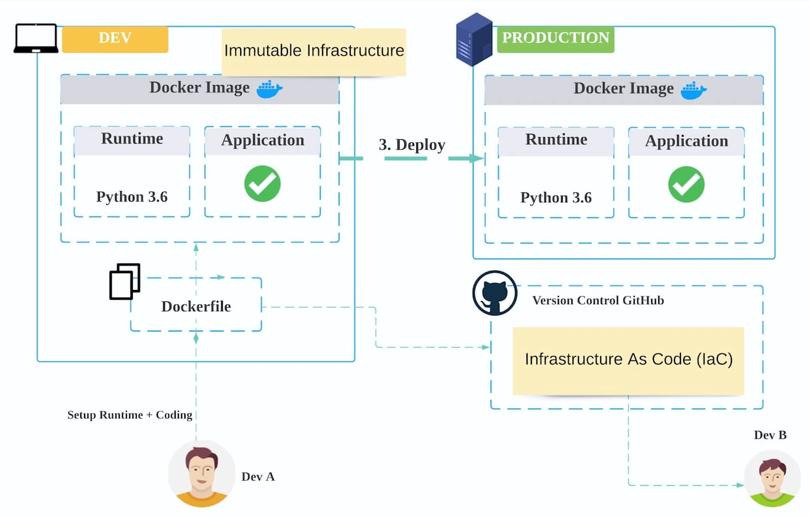

<h1 align="center"> About Docker File </h1>

# Dockerfile là gì ?

> Nó là 1 file dùng để build ra 1 **Image** tự động thông qua các dòng code trong **Dockerfile**.

> **Lợi ích:** Dockerfile giúp quản lý Runtime Environment, Configuration cùng Application bằng code. Đóng gói tất cả vào 1 image. Do Image là Read-only nên việc deploy image lên các môi trường là rất ổn định.

> **Immutable Infrastructure:** Phiên bản ổn định nhất, không đổi trong mọi môi trường khác nhau.

> **Infrastructure as Code:** Sử dụng Dockerfile để quản lý Infrastructure.



# Dockerfile Instructions

> Note: Nên viết các Instructions ít thay đổi ở trên. Để tiết kiệm thời gian build cũng như và size của các image layers.

## FROM

> Chỉ định ra base image sẽ sử dụng cho các instruction bên dưới.

> Hạn chế dùng tag latest để duy trì tính ổn định hệ thống.

```Dockerfile
  FROM <image-name:tag>
  # Ex
  FROM mysql:8.0
```

## ARG

> Tùy chỉnh và truyền vào Dockerfile 1 vài variable khi build. Tương tự khi chạy `--build-arg <varname>=<value>`

```Dockerfile
  ARG <name>[=<default value>]
  # Ex
  ARG version
```

## LABEL

> Dùng để mô tả thêm cho image (cung cấp các meta data cho image)

```Dockerfile
  LABEL <key>=<value> <key>=<value> <key>=<value> ...
  # Ex
  LABEL "com.example.vendor"="ACME Incorporated"
  LABEL version="1.0"
  LABEL description="This text illustrates \
  that label-value ..."
```

## ENV

> Tạo các biến môi trường cho container như tham số `-e`

```Dockerfile
  ENV <key>=<value>
  # Ex
  ENV DATABASE_HOST=localhost
```

## WORKDIR

> Dùng để thiết lập thư mục làm việc hiện tại cho bất kỳ chỉ thị RUN, CMD, ENTRYPOINT, COPY… trong quá trình build.

```Dockerfile
  WORKDIR <path>
  # Ex:
  WORKDIR /home/code

  # Ex2:
  ENV DIRPATH=/path
  WORKDIR $DIRPATH/$DIRNAME
  RUN pwd
```

## RUN

> Dùng để chạy các Linux command.

> Lưu ý: mỗi lần chạy `RUN` sẽ tạo ra 1 image layer, nếu có thể hãy gộp các lệnh RUN lại bằng `\`. Điều này giúp tiết kiệm size cho các images.

```Dockerfile
  RUN <command>
  #or
  RUN ["executable", "param1", "param2"]

  # Ex: tạo ra 2 image layers
  RUN apt-get update
  RUN apt-get install -y apache2 automake build-essential curl

  # Ex gộp các lệnh thành 1 RUN => 1 image layer
  RUN apt-get update \
    apt-get install -y apache2 automake build-essential curl \
    command...
```

## COPY, ADD

> COPY, ADD Dùng để copy file và thư mục từ hệ thống host tới image trong khi build. Với ADD chúng ta còn có thể tải 1 file từ URL.

```Dockerfile
  COPY [--chown=<user>:<group>] <src>... <dest>
  ADD [--chown=<user>:<group>] <src>... <dest>
  # Ex
  COPY html/* /var/www/html/
  ADD https://example.com/resource /app
```

## USER

> Chạy container với user nào. Mặc định là root.

```Dockerfile
  USER <user>[:<group>]
  # Ex
  USER dyno
```

## VOLUME

> Chỉ định 1 mount point để lưu trữ và chia sẻ dữ liệu giữa các containers.

```Dockerfile
  VOLUME <absolute_path>
  # Ex
  VOLUME /app/share
```

## EXPOSE

> Chỉ định port mà container sẽ chờ request đến.

```Dockerfile
  EXPOSE <port> [<port>/<protocol>]
  # Ex
  EXPOSE 80
```

## CMD, ENTRYPOINT

> Chỉ định 1 command sẽ chạy khi container khởi chạy.

```Dockerfile
  ENTRYPOINT ["executable", "param1", "param2"]
  # or
  CMD ["executable", "param1", "param2"]
  # Ex
  ENTRYPOINT ["/usr/bin/node", "index.js", "--env=DEV"]
```

> Nếu dùng cùng lúc CMD và ENTRYPOINT thì ENTRYPOINT sẽ là command còn CMD sẽ là tham số.

```Dockerfile
  ENTRYPOINT ["executable", "param1", "param2"]
  CMD ["param3", "param4"]
  # Ex
  ENTRYPOINT ["/usr/bin/node", "index.js"]
  CMD ["--env=DEV"]
```

# Command

> Build 1 Dockerfile

```sh
  docker build -t <image_name>:<tag> -f <Dockerfile_name> <Dockerfile_folder_path>
```
